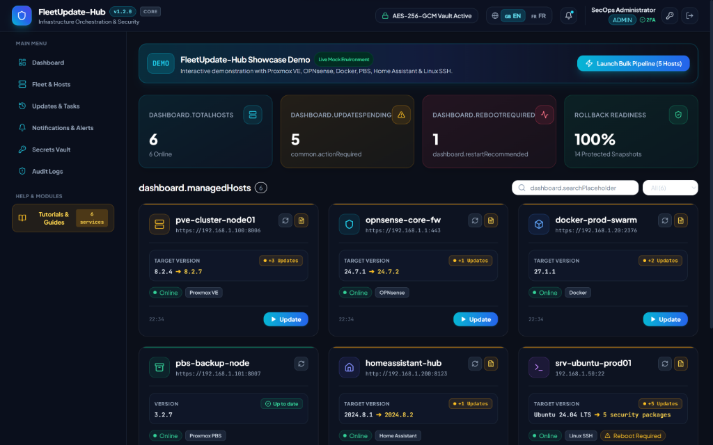
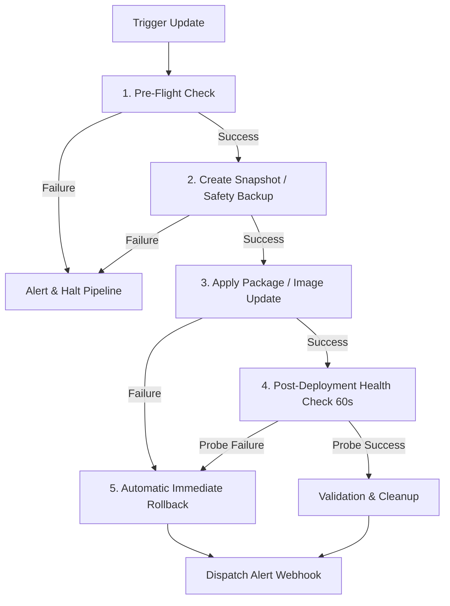

# 🛡️ FleetUpdate-Hub

<p align="center">
  
</p>

<p align="center">
  <strong>The Zero-Trust, Multi-Platform Update Orchestrator & Vulnerability Management Hub for Homelabs and Enterprise Infrastructure.</strong>
</p>

<p align="center">
  <a href="LICENSE"></a>
  <a href="docs/SECURITY_ZERO_TRUST.md"></a>
  <a href="https://www.typescriptlang.org/"></a>
  <a href="docker-compose.yml"></a>
  <a href="https://github.com/Rivolte-HL/fleetupdate-hub/actions"></a>
  <a href="CONTRIBUTING.md"></a>
</p>

---

## 💡 Project Origin & Call for Community Review

> **👋 Note from the Author:**
> FleetUpdate-Hub started because I couldn't find an existing self-hosted tool to safely orchestrate updates across my own mixed homelab (Proxmox, OPNsense, Docker, Linux, and Home Assistant) with automated snapshots and instant rollbacks.
> 
> Since I am not a full-time senior software engineer, I used **AI-assisted development** to bootstrap this working prototype. 
> 
> **I am actively seeking experienced developers, security auditors, and sysadmins to:**
> - 🔍 **Review the Codebase & Security:** Audit the AES-256-GCM vault, token handling, and pipeline state machine for potential edge cases.
> - 🧩 **Contribute New Adapters:** Help build integrations for TrueNAS, Unraid, Kubernetes, Synology DSM, Mikrotik RouterOS, pfSense, etc.
> - 🚀 **Help Maintain & Improve:** Turn this prototype into a mature, resilient community standard.

---

## 🌟 Why FleetUpdate-Hub?

Updating complex, heterogeneous infrastructures is risky, fragmented, and tedious:
- **Proxmox VE & PBS** require manual shell updates and risk hypervisor instability without verified snapshots.
- **OPNsense Firewalls** need manual web navigation and careful kernel reboot monitoring.
- **Multi-Host Docker Daemons** require manual digest tracking, image pruning, and painful rollbacks when containers crash.
- **Agentless Linux Servers** (Ubuntu, Debian, RHEL, Arch, Alpine, openSUSE) require custom ad-hoc scripts.
- **Home Assistant Smart Hubs** require coordinated Supervisor snapshots before Core updates.

**FleetUpdate-Hub** unifies everything into a single, cyber-hardened dashboard backed by a **deterministic 5-phase execution pipeline** with **automated rollback**, **AES-256-GCM cryptographic vaulting**, and **least-privilege service accounts**.

---

## 🖥️ Unified SecOps Dashboard

<p align="center">
  
</p>

---

## 🚀 Supported Platforms & Adapters

| Platform / Target | Protocol / Auth | Safety Backup Mechanism | Upgrade Action |
| :--- | :--- | :--- | :--- |
| **Proxmox VE** | `PVEAPIToken` + SSH | QEMU/LXC Atomic Snapshots or protected `vzdump` | SSH `apt-get dist-upgrade` & kernel verification |
| **Proxmox Backup Server (PBS)** | `PBSAPIToken` + SSH | Datastore verification checkpoint | SSH package upgrade & reboot validation |
| **OPNsense Firewall** | API Key & Secret | Automatic XML configuration backup | Core REST API firmware upgrade |
| **Docker Multi-Host** | TCP / HTTPS Socket / mTLS | Pre-update layer & digest retention | Registry digest check + Container recreation |
| **Agentless Linux SSH** | Ed25519 Key / Sudoers | `/etc` snapshot archive | Non-interactive APT, DNF, Pacman, APK, Zypper |
| **Home Assistant** | Long-Lived Access Token | Supervisor Backup (`backup: true`) | POST `/api/services/update/install` |

---

## 🔄 Deterministic 5-Phase Pipeline & Automated Rollback

Every orchestrated update follows a strict, deterministic state machine:



1. **Pre-Flight Check:** Validates host connectivity, disk headroom, and lock exclusivity.
2. **Safety Backup:** Creates an atomic restore point tailored to the target platform (vzdump, snapshot, XML backup, image retention).
3. **Apply Update:** Dispatches package, firmware, or container updates with live output streaming over WebSockets.
4. **Post-Deployment Health Check:** Executes active probes (HTTP/HTTPS, TCP socket, ICMP) over a configurable observation window (default: 60s).
5. **Rollback or Finalize:** If probes fail, the orchestrator triggers an immediate automated rollback to the pre-update state.

---

## ⚡ Quick Start (Production Docker Compose)

### 1. Clone the Repository
```bash
git clone https://github.com/Rivolte-HL/fleetupdate-hub.git
cd fleetupdate-hub
```

### 2. Generate Secrets & Environment Configuration
Run the 1-click generator to provision cryptographically secure keys and generate a complete `.env` file:
- **Linux / macOS:**
  ```bash
  bash scripts/generate-secrets.sh
  ```
- **Windows (PowerShell):**
  ```powershell
  pwsh scripts/generate-secrets.ps1
  ```

### 3. Start the Stack
```bash
docker compose up -d
```

Access the web console at **`http://localhost:3000`** (or via your HTTPS Reverse Proxy e.g. Nginx, Traefik, NPM, Caddy).

- **Default Administrator:** `admin@fleetupdate.local`
- **Password:** Automatically configured in `.env` (or printed in `docker compose logs backend`).

---

## 🎯 Interactive Demo Mode

Want to test the full interface and all 6 server types without connecting live hardware?

1. **In the Web App:** Navigate to **`http://localhost:3000/demo`** to interact with the full mock infrastructure, trigger simulated pipelines, and test multi-channel notifications.
2. **Offline HTML Preview:** Double-click [`docs/showcase-demo.html`](docs/showcase-demo.html) to open a standalone showcase in any web browser with zero server dependencies.

---

## 🛡️ Target Least-Privilege Setup Scripts

FleetUpdate-Hub enforces the principle of least privilege across all integrations:

- **Proxmox VE:** Run `sudo ./scripts/setup-target-proxmox.sh` on your PVE node to create the dedicated `fleetupdate@pve` role and API token.
- **OPNsense:** Follow [`scripts/setup-target-opnsense.md`](scripts/setup-target-opnsense.md) to generate an API key restricted to `System: Firmware`.
- **Linux Servers:** Run `sudo ./scripts/setup-target-linux.sh "<ssh-ed25519-public-key>"` to create the dedicated `fleetupdate` user with strict sudoers rules for package managers only.
- **Docker Hosts:** Follow [`scripts/setup-target-docker.sh`](scripts/setup-target-docker.sh) for secure TLS / mTLS configuration.
- **Home Assistant:** Follow [`scripts/setup-target-homeassistant.md`](scripts/setup-target-homeassistant.md) to generate a Long-Lived Access Token.

---

## 📚 Documentation & Guides

* 🏛️ **[Architecture & Design](docs/ARCHITECTURE.md)**: Hexagonal architecture, service registry, state machine, and REST routes.
* 🔒 **[Zero-Trust Cryptography](docs/SECURITY_ZERO_TRUST.md)**: AES-256-GCM vault, network segmentation, and TOTP 2FA.
* 🛡️ **[Security Policy](SECURITY.md)**: Vulnerability disclosure guidelines and version support matrix.
* 🤝 **[Contributing Guide](CONTRIBUTING.md)**: Coding standards, adding new adapters, and PR checklist.
* 📜 **[Changelog](CHANGELOG.md)**: Version release notes.

---

## 📄 License

Distributed under the **Apache 2.0** License. See [`LICENSE`](LICENSE) for details.
