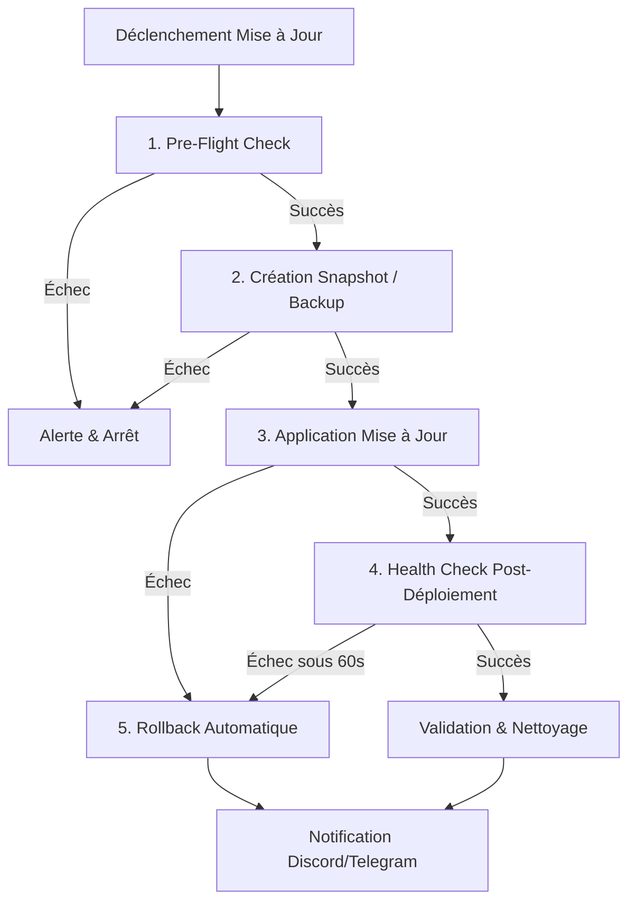

# 🛡️ FleetUpdate-Hub

**Système centralisé d'orchestration et de sécurisation des mises à jour pour infrastructures hétérogènes.**

FleetUpdate-Hub unifie la détection, la validation, le déploiement et le contrôle post-intervention pour :
- **Hyperviseurs Proxmox VE** (API Tokens, Snapshots QEMU/LXC, Backups vzdump protégés)
- **Pare-feux & Routeurs OPNsense** (API REST MVC, firmware upgrade, contrôle des reboots)
- **Démons Docker Multi-Hôtes** (Sockets TLS/SSH, hashs SHA256, étiquettes OCI, release notes GitHub, rollback 60s)
- **Serveurs Linux Agentless SSH** (APT, DNF, Pacman, détection `/var/run/reboot-required`)
- **Domotique Home Assistant** (Long-Lived Tokens, entités `update.*`, sauvegarde Supervisor intégrée)

---

## 🔒 Architecture de Sécurité Zero-Trust

1. **Coffre de Secrets Chiffré au Repos** :
   - Tous les identifiants (clés privées SSH, tokens API, mots de passe) sont chiffrés en base de données avec l'algorithme **AES-256-GCM** (IV 96-bit unique par enregistrement + Tag d'authentification 128-bit anti-altération).
   - La clé maîtresse est injectée exclusivement par variable d'environnement ou fichier de secret Docker (`/run/secrets/master_key`) et ne réside jamais dans les fichiers de configuration ou dépôts Git.
2. **Isolation Réseau Stricte (Docker Compose)** :
   - Réseau `internal-net` non routable vers l'extérieur pour la base de données PostgreSQL.
   - Réseau `mgmt-net` réservé aux flux d'administration vers les équipements cibles.
3. **Authentification & Contrôle d'Accès** :
   - JWT sécurisé transmis via cookie `HttpOnly` avec protection CSRF et support 2FA **TOTP** (Google Authenticator, FreeOTP).
   - Contrôle d'accès basé sur les rôles (**RBAC**) : `ADMIN`, `OPERATOR`, `VIEWER`.
4. **Journaux d'Audit Immuables** :
   - Traçabilité complète de chaque action administrative et déclenchement de tâche dans la table `audit_logs`.

---

## 🚀 Déploiement en Production (Docker Compose)

### 1. Prérequis
- Docker Engine 24+ & Docker Compose v2

> **⚠️ Règle d'Or Anti-Circularité :**
> FleetUpdate-Hub ne doit **jamais** gérer sa propre mise à jour ou celle de son propre hôte physique. Déployez FleetUpdate-Hub sur une VM / conteneur dédié distinct.

### 2. Lancement Instantané (Zéro Configuration)
Clonez le dépôt et lancez directement la pile :
```bash
git clone https://github.com/Rivolte-HL/fleetupdate-hub.git
cd fleetupdate-hub
docker compose up -d
```
*Au premier démarrage, le système génère automatiquement une clé maîtresse **AES-256-GCM** et un secret JWT aléatoires et persistants dans un volume sécurisé.*

### 3. (Optionnel) Personnalisation & Secrets Manuels
Si vous préférez définir vos propres mots de passe et clés cryptographiques manuellement :
- Copiez `.env.example` en `.env` et ajustez vos variables :
  ```bash
  cp .env.example .env
  ```
- Ou exécutez le générateur de secrets :
  ```bash
  ./scripts/generate-secrets.sh
  ```

L'interface d'administration est accessible sur : `http://<IP_DU_SERVEUR>:3000` (ou via votre Reverse Proxy HTTPS Nginx/Traefik).

**Identifiants administrateur initiaux :**
- Email : `admin@fleetupdate.local`
- Mot de passe : `FleetAdminChangeMeNow123!` *(à modifier dès la première connexion avec activation du 2FA)*.

---

## 📋 Configuration des Cibles (Principe du Moindre Privilège)

### 1. Proxmox VE
Exécutez le script d'initialisation sur votre nœud Proxmox :
```bash
sudo ./scripts/setup-target-proxmox.sh
```
Crée un rôle restreint `FleetUpdateRole` (`Sys.Audit`, `VM.Audit`, `VM.Backup`, `VM.Snapshot`, `VM.Snapshot.Rollback`) et génère un jeton API dédié `fleetupdate@pve!update-agent`.

### 2. OPNsense
Suivez le guide [`scripts/setup-target-opnsense.md`](scripts/setup-target-opnsense.md) pour créer un utilisateur d'API restreint au module `core/firmware/*`.

### 3. Serveurs Linux (SSH Agentless)
Déployez le compte de service à droits restreints :
```bash
sudo ./scripts/setup-target-linux.sh "<ssh-ed25519-public-key>"
```
Limite l'élévation `sudo` sans mot de passe uniquement aux gestionnaires de paquets (`apt`, `apt-get`, `dnf`, `pacman`, `needrestart`).

---

## 🔄 Pipeline d'Exécution & Rollback Automatique

Chaque mise à jour exécutée suit une séquence déterministe en 5 étapes :



---

## 🧩 Extensibilité & Pattern Adapter

Pour ajouter un nouveau type de service (ex: NAS TrueNAS, serveurs de jeux, routeurs Mikrotik) :
1. Créez une classe étendant `BaseServiceAdapter` dans `backend/src/adapters/`.
2. Implémentez les méthodes imposées :
   - `checkVersion()`
   - `fetchChangelog()`
   - `createBackup()`
   - `applyUpdate()`
   - `healthCheck()`
   - `rollback()`
3. Déclarez les champs requis dans `getMetadata()`.
4. Enregistrez l'adaptateur dans `ServiceRegistry.getInstance().registerAdapter(...)`.
Le frontend générera automatiquement les formulaires et cartes de suivi sans aucune modification de code supplémentaire !
