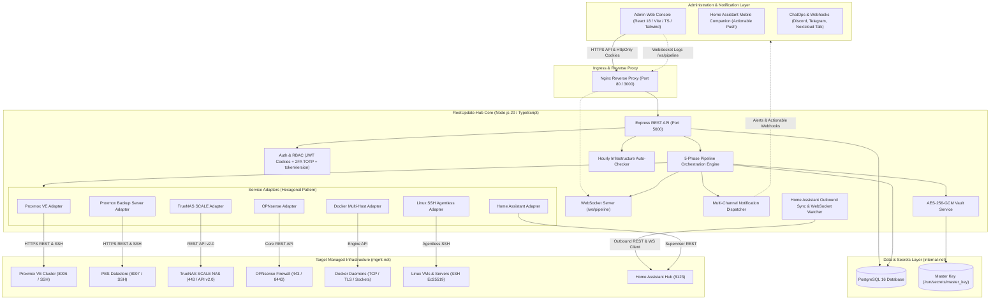
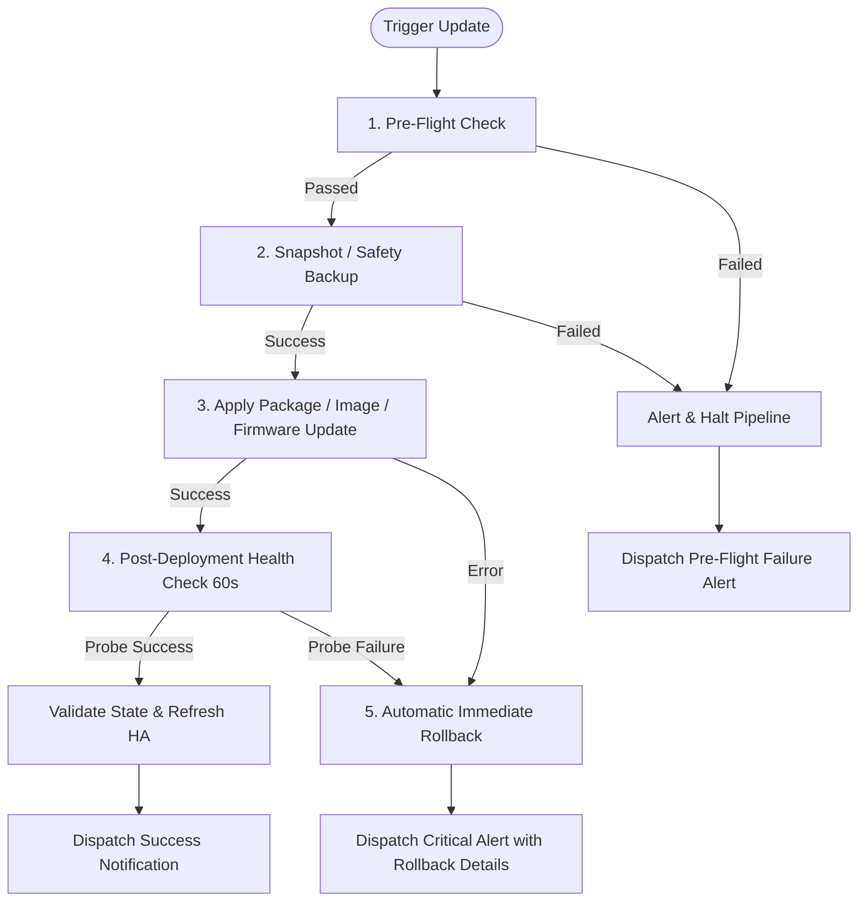

# 🏛️ FleetUpdate-Hub Architecture & System Design

## 1. Executive Overview & Problem Statement

Modern enterprise infrastructures and homelabs operate a heterogeneous mix of virtualization hypervisors, hardware firewalls, storage appliances, container engines, and agentless operating systems.

Prior to **FleetUpdate-Hub**, updating such infrastructure was fragmented across disparate management silos:
- Hypervisors (**Proxmox VE & PBS**) required manual snapshots and terminal package upgrades.
- Storage appliances (**TrueNAS SCALE**) required separate attention for base OS updates versus containerized application upgrades.
- Firewalls (**OPNsense**) required navigating separate web interfaces and handling reboot cycles manually.
- Container hosts (**Docker Engine**) required image digest auditing, container recreating, and risky manual rollbacks.
- Agentless Linux servers (**Debian, Ubuntu, RHEL, Arch, Alpine, openSUSE**) required custom SSH scripts without standardized verification.
- Smart home hubs (**Home Assistant**) required careful coordination between Core/OS updates and automated Supervisor snapshots.

**FleetUpdate-Hub** unifies everything into a single, secure (**Zero-Trust**), modular (**Adapter Pattern**), and resilient (**Automated 5-Phase Rollback Pipeline**) management platform.

---

## 2. Global System Architecture

The platform is structured into clean modular tiers:



---

## 3. Adapter Pattern & Supported Platforms

All target platforms implement the abstract `BaseServiceAdapter` contract managed by the singleton `ServiceRegistry`:

```typescript
export abstract class BaseServiceAdapter {
  abstract getMetadata(): AdapterMetadata;
  abstract checkVersion(host: Host, credentials: TargetCredentials): Promise<VersionInfo>;
  abstract fetchChangelog(host: Host, credentials: TargetCredentials): Promise<ChangelogItem[]>;
  abstract createBackup(host: Host, credentials: TargetCredentials, backupName?: string): Promise<BackupResult>;
  abstract applyUpdate(host: Host, credentials: TargetCredentials, onProgress?: (step: string, log: string) => void): Promise<UpdateExecutionResult>;
  abstract healthCheck(host: Host, credentials: TargetCredentials): Promise<HealthCheckResult>;
  abstract rollback(host: Host, credentials: TargetCredentials, backupIdentifier: string, onProgress?: (step: string, log: string) => void): Promise<RollbackResult>;
}
```

### Supported Integration Adapters:

| Adapter | Target Type | Protocol / Auth | Backup & Safety Mechanism | Upgrade Action & Rollback |
| :--- | :--- | :--- | :--- | :--- |
| **Proxmox VE** | `PROXMOX` | `PVEAPIToken` + SSH | QEMU/LXC atomic snapshots or `vzdump` | SSH `apt-get dist-upgrade`; hypervisor kernel restore via GRUB checkpoint |
| **PBS** | `PROXMOX_BACKUP_SERVER` | `PBSAPIToken` + SSH | Background task & GC lock audit | SSH `apt-get dist-upgrade` & datastore integrity verification |
| **TrueNAS SCALE** | `TRUENAS` | API Key (Bearer) / Basic | ZFS safety snapshot (`boot-pool` or custom dataset) + Config DB archive | REST API v2.0 OS upgrade & Docker/Helm app updates; ZFS rollback |
| **Docker Engine** | `DOCKER` | TCP, HTTPS, or mTLS socket | Image tag retention (`fleetupdate-backup:*`) & container rename | Zero-downtime container recreate with network/volume preservation; auto-rollback on unhealthy exit |
| **Linux SSH** | `LINUX_SSH` | Ed25519 Key / Sudoers | `/etc` snapshot archive in `/var/backups/fleetupdate/` | Non-interactive package upgrade (APT, DNF, Pacman, APK, Zypper); `/etc` archive restore |
| **Home Assistant** | `HOME_ASSISTANT` | Long-Lived Access Token | Supervisor Backup (`backup/create` or `backup: true`) | POST `/api/services/update/install` with automatic backup flag |
| **OPNsense** | `OPNSENSE` | API Key & Secret | Automatic local XML config backup | Core REST firmware upgrade polling with automatic reboot recovery |

---

## 4. Resilient 5-Phase Execution Pipeline

Every orchestrated update follows a strict, deterministic state machine:



### Execution Steps Breakdown:
1. **Pre-Flight Check:** Validates host reachability, credentials, disk headroom, and lock exclusivity.
2. **Snapshot / Safety Backup:** Creates a point-in-time rollback artifact adapted to the target platform (ZFS snapshot, vzdump archive, XML configuration, or Docker tagged image layer). **The update never proceeds if this step fails.**
3. **Apply Update:** Dispatches package, firmware, or container updates with live output streaming over WebSockets.
4. **Post-Deployment Health Check:** Executes active probes (HTTP/HTTPS, TCP socket, ICMP) over a configurable observation window (default: 60s).
5. **Rollback or Finalize:** If probes fail, the orchestrator triggers an immediate automated rollback to the pre-update state and dispatches priority notifications.

### Concurrency & Race-Condition Protection:
`UpdatesService.triggerUpdate` uses a pessimistic transactional lock (`SELECT ... FOR UPDATE` via Prisma raw query) to ensure that concurrent update requests on the same host are rejected immediately with `TASK_ALREADY_RUNNING`.

---

## 5. Security & Zero-Trust Core

1. **AES-256-GCM Vault at Rest:**
   - All credentials (SSH private keys, API tokens, passwords) are encrypted in PostgreSQL using **AES-256-GCM** with unique 96-bit random IVs and 128-bit authentication tags.
   - Master key is injected strictly via environment variables or Docker Secrets (`/run/secrets/master_key`).
2. **Immediate Session Invalidation (`tokenVersion`):**
   - User sessions use `HttpOnly` and `SameSite=Strict` cookies. Changing a password or 2FA configuration increments the user's `tokenVersion`, instantly invalidating active sessions across all devices.
3. **Timing Attack Protection:**
   - All cryptographic comparisons (webhook secret tokens, signatures, authentication hashes) use `crypto.timingSafeEqual`.
4. **Network Segmentation:**
   - `internal-net`: Isolated internal bridge network for PostgreSQL database and backend without external port exposure.
   - `mgmt-net`: Dedicated outbound bridge network for reaching target managed infrastructure.
5. **Immutable Audit Trails:**
   - Every administrative action, credential rotation, and update task execution is immutably recorded in the `audit_logs` table.
