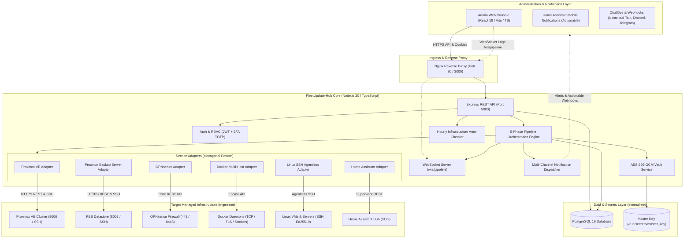
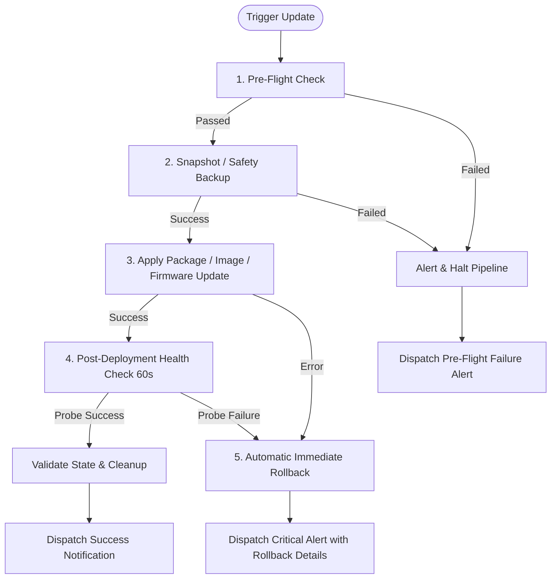

# 🏛️ FleetUpdate-Hub Architecture & System Design

## 1. Executive Overview & Problem Statement

Modern enterprise infrastructures and advanced homelabs operate a heterogeneous mix of virtualization hypervisors, hardware firewalls, container engines, and agentless operating systems.

Prior to **FleetUpdate-Hub**, updating such infrastructure was fragmented across disparate management silos:
- Hypervisors (**Proxmox VE / PBS**) required manual snapshots and terminal package upgrades.
- Firewalls (**OPNsense**) required navigating separate web interfaces and handling reboot cycles manually.
- Container hosts (**Docker Engine**) required image digest auditing, container recreating, and risky manual rollbacks.
- Agentless Linux servers (**Debian, Ubuntu, RHEL, Arch, Alpine, openSUSE**) required custom SSH scripts without standardized verification.
- Smart home hubs (**Home Assistant**) required careful coordination between Core/OS updates and automated Supervisor snapshots.

**FleetUpdate-Hub** solves this fragmentation by providing a unified, secure (**Zero-Trust**), modular (**Adapter Pattern**), and resilient (**Automated 5-Phase Rollback Pipeline**) management platform.

---

## 2. Global System Architecture

The platform is structured into clean modular tiers:



---

## 3. Adapter Pattern & Extensibility

All target platforms implement the abstract `BaseServiceAdapter` contract managed by the singleton `ServiceRegistry`:

```typescript
export abstract class BaseServiceAdapter {
  abstract getMetadata(): AdapterMetadata;
  abstract checkVersion(host: Host, credentials: TargetCredentials): Promise<VersionInfo>;
  abstract fetchChangelog(host: Host, credentials: TargetCredentials): Promise<ChangelogItem[]>;
  abstract createBackup(host: Host, credentials: TargetCredentials, backupName?: string): Promise<BackupResult>;
  abstract applyUpdate(host: Host, credentials: TargetCredentials, onProgress?: (step: string, log: string) => void): Promise<UpdateExecutionResult>;
  abstract healthCheck(host: Host, credentials: TargetCredentials): Promise<HealthCheckResult>;
  abstract rollback(host: Host, credentials: TargetCredentials, backupIdentifier: string, onProgress?: (step: string, log: string) => void): Promise<RollbackResult>;
}
```

### Supported Integration Adapters:

| Adapter | Target Type | Authentication | Backup / Snapshot Mechanism | Deployment & Execution Action |
| :--- | :--- | :--- | :--- | :--- |
| **Proxmox VE** | `PROXMOX` | `PVEAPIToken` + SSH | QEMU/LXC Atomic Snapshots or protected `vzdump` | SSH `apt-get dist-upgrade` & package installation |
| **PBS** | `PROXMOX_BACKUP_SERVER` | `PBSAPIToken` + SSH | Datastore verification checkpoint | SSH system package upgrade & node reboot audit |
| **OPNsense** | `OPNSENSE` | API Key & Secret | Automatic XML config backup | POST `/api/core/firmware/upgrade` |
| **Docker Engine** | `DOCKER` | TCP/HTTPS / mTLS / Socket | Backup image layer retention | Registry digest check + Container recreation |
| **Linux SSH** | `LINUX_SSH` | Ed25519 Key / Sudoers | `/etc` snapshot archive | Agentless SSH APT, DNF, Pacman, APK, Zypper |
| **Home Assistant** | `HOME_ASSISTANT` | Long-Lived Token | Supervisor Backup (`backup: true`) | POST `/api/services/update/install` |

---

## 4. Resilient 5-Phase Execution Pipeline

Every orchestrated update follows a deterministic state machine:



### Execution Steps Breakdown:
1. **Pre-Flight Check:** Validates host reachability, credentials, and ensures no conflicting lock or update operations are in progress.
2. **Snapshot / Safety Backup:** Creates a point-in-time rollback artifact adapted to the target platform (QEMU/LXC snapshot, vzdump archive, XML configuration, or Docker tagged image layer).
3. **Apply Update:** Dispatches package, firmware, or container updates with live output streaming over WebSockets.
4. **Post-Deployment Health Check:** Executes active probes (HTTP/HTTPS, TCP socket, ICMP) over a configurable observation window (default: 60s).
5. **Rollback or Finalize:** If probes fail, the orchestrator triggers an immediate automated rollback to the pre-update state and dispatches priority notifications.

---

## 5. Security Architecture (Zero-Trust)

1. **AES-256-GCM Vault at Rest:**
   - All credentials (SSH private keys, API tokens, passwords) are encrypted in PostgreSQL using **AES-256-GCM** with a unique 96-bit random IV and 128-bit authentication tag.
   - Master key is injected strictly via environment variables or Docker Secrets (`/run/secrets/master_key`).
2. **Network Segmentation:**
   - `internal-net`: Isolated internal bridge network for PostgreSQL database and backend IPC without external port exposure.
   - `mgmt-net`: Dedicated outbound bridge network for reaching target managed infrastructure.
3. **Hardened Web Sessions:**
   - JWT tokens transmitted via `HttpOnly`, `SameSite=Strict`, and `Secure` (production) cookies.
   - Two-Factor Authentication (**2FA TOTP**) with encrypted secrets.
   - Role-Based Access Control (**RBAC**): `ADMIN`, `OPERATOR`, `VIEWER`.
4. **Immutable Audit Trails:**
   - Every administrative action, credential rotation, and update task execution is immutably recorded in the `audit_logs` table.
